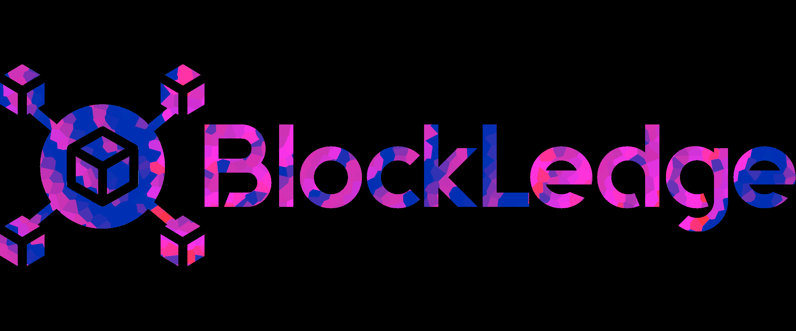

<div align="center">

</div>

# Blockledge

Blockledge, is a blockchain-based application designed for secure and transparent data management. It leverages the decentralized nature of blockchain technology to ensure data integrity, security, and immutability, making it a valuable solution for industries that require secure data verification.

## How it works

#### Architecture
This is a dApp or decentralized application with a simple frontend connected with a set of backend services composed by a Smart Contract deployed to Ethereum testnet and a storage service using IPFS.

>The **Smart Contract** role is to store basic information about the users and files stored in the app. 

>  **IPFS** is a P2P API for storing files in a decentralized way, where each client work as a node for persisting files.
> [Learn more](https://ipfs.io/)


#### Stack

- [Solidity](https://docs.soliditylang.org/en/v0.8.13/) for Smart Contract development on **Ethereum**.
- [Truffle Suite](https://trufflesuite.com/) for local infrastructure and SC deployment.
- [Ganache](https://trufflesuite.com/ganache/index.html) as a local development blockchain.
- [Metamask](https://metamask.io/) for in-browser user authentication.
- [React.js](https://reactjs.org/) (Next.js Framework).
- [Mocha/Chai](https://mochajs.org/) for Smart Contract testing
- [Tailwind CSS](https://tailwindcss.com/) for styling components.

#### Basic Process

1. The users connect their account to **Metamask** after pressing _Connect_ button (the app attempts to do this automatically if there is an existing account logged in in Metamask).
2. Once there is a connected account in the app, the app enables the button for start uploading files on the **Upload** section.
3. Once you uploaded your first file, you will be able to see the result in the **Files** section (Below the upload section). 

## Running locally

#### Configuring the app

First, configure `.env` file for blockchain configuration

```bash
INFURA_PROJECT_ID = <Your Infura Project ID>
PRIVATE_KEY = <Your Infura private key>
ACCOUNT_ADDRESS = <Your Account Address>
```

Then, configure `.env.local` file for frontend application.


```bash
NEXT_PUBLIC_MODE = <PROD | DEV (depending of your environment)>
NEXT_PUBLIC_CONTRACT = <Address of the smart contract>
```
#### Smart contract migration and deployment

In case you want to run locally for development, run a local blockchain using Ganache.

First, initialize truffle project on the repo.

```bash
truffle init
```

Then migrate smart contracts to ganache or any other network (see `truffle-config.js` for configuring networks).

In case you're running Ganache.

```bash
truffle migrate --network development
```

#### Running frontend application

Then, run the development server:

```bash
npm run dev
# or
yarn dev
```

Open [http://localhost:3000](http://localhost:3000) with your browser to see the result.
